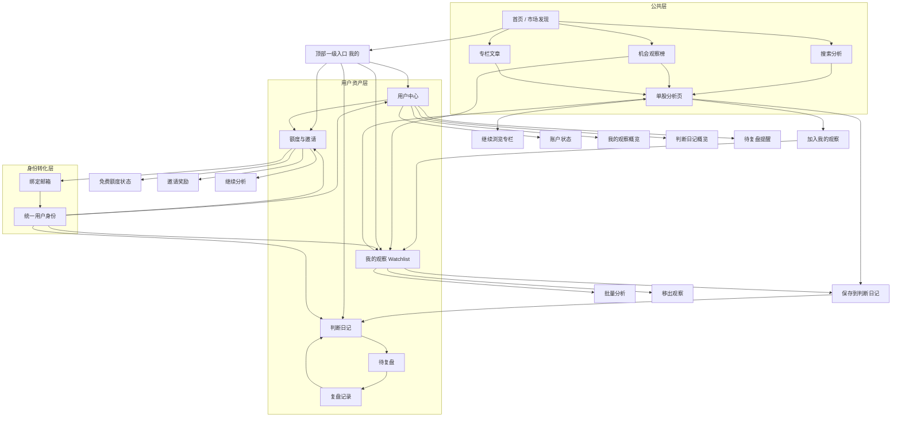
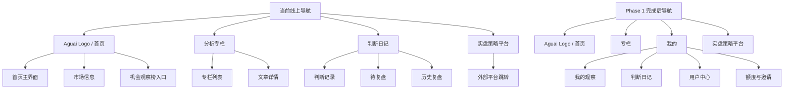
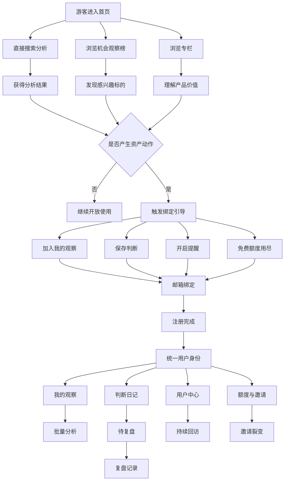

# 用户体系信息架构设计

## 背景
当前系统的股票分析体验已经比较顺滑，但用户体系还没有形成真正的闭环。现有能力中，匿名身份、邮箱绑定、邀请、配额、判断日记等基础设施已经存在，但尚未被统一成清晰的用户资产体系。

本设计文档的目标，是把用户体系相关的信息架构、页面关系、导航结构和转化路径固化下来，作为后续产品设计与实现的文档资产。

## Phase 1 落地状态
截至当前版本，用户体系 Phase 1 的最小闭环已经落地，重点不是“完整资料页”，而是先把用户资产收口。

已完成能力：
- 统一用户模型：`users` + `user_identities`
- 统一身份解析：匿名 ID、`aguai_uid`、邮箱绑定身份都可归集到同一 `user_id`
- 游客可试用 `watchlist`，绑定后长期保存
- 判断日记已纳入统一用户资产，绑定后可持续追踪复盘
- 用户中心 MVP 已上线，路径为 `/me`
- `额度` 与 `邀请` 已按统一 `user_id` 归集，避免多身份裂变
- 观察、判断、额度耗尽等关键动作已加入绑定引导

当前线上信息架构已经从“纯能力散点”进入“分析 -> 观察 -> 判断 -> 复盘 -> 用户中心”的闭环阶段。

## 设计原则
- 分析是开放的：不注册也可以先体验核心分析能力。
- 资产是私有的：`watchlist`、判断日记、复盘记录、提醒、邀请关系、额度等最终归属于用户。
- 绑定是为了保存与继续使用：邮箱绑定不是为了“有账号”，而是为了资产沉淀、跨设备同步和长期召回。
- 公共内容与个人资产分离：专栏文章默认属于平台公共内容，不天然绑定到用户资产。
- 用户转化是渐进的：先体验，再在产生资产动作时引导绑定，而不是先登录再使用。
- 已有真实用户在使用：后续所有改动都必须遵循“兼容旧路径、减少认知打扰、分阶段收口”的原则，避免让现有用户突然失去熟悉入口。

## 用户身份分层
### 1. 游客
- 可直接搜索分析
- 可浏览机会观察榜
- 可阅读专栏文章
- 拥有基础免费额度

### 2. 已识别用户
- 完成邮箱绑定
- 拥有统一用户身份
- 可以持有个人资产：
  - `watchlist`
  - 判断日记
  - 待复盘记录
  - 提醒设置
  - 邀请关系
  - 额度记录

### 3. 已完善用户
- 在已识别用户基础上，补充昵称、头像、偏好、公开设置等
- 资料完善不作为“注册完成”的前置条件

## 页面角色定义
### 机会观察榜
系统帮助用户发现值得进一步关注的股票，是“发现层”的核心页面。

它回答的问题是：
- 最近有哪些结构上更值得关注的股票？
- 我应该优先把哪些股票放进自己的观察池？

### 我的观察 `watchlist`
`watchlist` 是观察池，不是判断池。

它回答的问题是：
- 我最近想持续看哪些标的？
- 哪些标的值得统一分析？
- 哪些还需要继续观察？

它更偏：
- 发现后的承接
- 跟踪
- 批量分析
- 轻量管理

### 判断日记
判断日记是决策与复盘池，不是观察池。

它回答的问题是：
- 我曾经基于什么前提做过判断？
- 这些判断后来验证得怎么样？
- 哪些该复盘？

它更偏：
- 结构判断
- 条件记录
- 验证周期
- 复盘沉淀

## 三者关系
- 机会观察榜：系统帮用户发现值得看的股票
- 我的观察：用户把值得持续跟踪的股票收进自己的观察池
- 判断日记：用户把已经形成结构判断的分析沉淀成可验证、可复盘的资产

同一只股票可以同时存在于：
- `watchlist`：因为它仍值得持续观察
- 判断日记：因为用户已经基于它形成过判断

因此它们不是互斥关系，而是前后衔接关系。

## 导航策略
### 当前线上导航基线
当前线上导航应以现有主流程为主，不强行提前引入尚未完善的“我的”入口。

建议保留为：
- `Aguai` Logo（承担首页入口）
- 分析专栏
- 判断日记
- 实盘策略平台（外部链接）

其中：
- `Aguai` Logo 等价于首页入口
- `配查查` 可以移除
- `我的` 在用户体系与相应页面完善后再上线

### 目标导航结构（用户体系 Phase 1 完成后）
用户体系第一版完成后，再逐步过渡到更清晰的资产入口结构：
- `Aguai` Logo（首页）
- 专栏
- 我的
- 实盘策略平台（外部链接）

此时：
- 判断日记会收编进 `我的`
- 我的观察、用户中心、额度与邀请也统一进入 `我的`
- 不再单独保留一个含义模糊的“分析”一级导航

### 当前已落地导航结构
当前代码中已经按 Phase 1 目标结构完成第一步收口：
- `Aguai` Logo（首页）
- 分析专栏
- `我的`
- 实盘策略平台（外部链接）

`我的` 下拉中包含：
- 我的观察
- 判断日记
- 用户中心
- 额度与邀请

同时：
- 未绑定用户在导航中会看到显式的 `绑定邮箱` 入口
- `配查查` 已移除
- 原先顶层单列的“判断日记”已收编进 `我的`

### 为什么不用“用户账户”作为唯一入口
- 桌面端 hover 下拉对移动端不友好
- `watchlist` 和判断日记属于核心资产页，完全隐藏会削弱留存入口
- “会员主页”会引起付费会员误解，不适合作为主命名

### 推荐做法
在用户体系页面尚未完善前，继续保留当前线上结构；待用户体系 Phase 1 完成后，再上线一级入口 `我的`，并在其下拉或展开面板中包含：
- 我的观察
- 判断日记
- 用户中心
- 额度与邀请

## 页面目标与核心动作
### 我的观察
页面目标：
- 管理持续关注的标的
- 承接机会观察榜和搜索加入的股票
- 作为批量分析入口

核心按钮：
- 加入观察
- 批量分析
- 去分析
- 移出观察
- 标记已形成判断

### 判断日记
页面目标：
- 管理已经形成明确判断的记录
- 承接验证与复盘动作

核心按钮：
- 保存判断
- 查看详情
- 去复盘
- 删除
- 回到观察

### 用户中心
页面目标：
- 账户状态与资产总览
- 作为个人工作台，而不是简单资料页

核心模块：
- 绑定状态
- 当前额度
- 我的观察概览
- 判断日记概览
- 待复盘提醒
- 邀请入口

核心按钮：
- 绑定邮箱
- 查看我的观察
- 查看判断日记
- 获取更多额度

## 游客与绑定用户的差异
### 游客
- 可以分析
- 可以浏览专栏
- 可以浏览机会观察榜
- 可以体验观察动作
- 资产只在当前设备临时存在

### 绑定用户
- 资产长期保存
- 可跨设备同步
- 可持有完整 `watchlist`
- 可持有判断资产与复盘资产
- 可使用提醒
- 可参与邀请奖励体系

## 转化触发点
绑定引导不应只发生在额度耗尽时，而应围绕资产动作触发。

推荐触发点：
- 第一次加入 `watchlist`
- 第一次保存判断
- 第一次尝试开启提醒
- 第一次进入待复盘
- 免费额度耗尽
- 想通过邀请获取更多额度

推荐表达方式：
- 绑定邮箱，保存你的观察资产
- 绑定后可持续追踪复盘
- 绑定后你的资产不会因换设备或清缓存而丢失
- 绑定后可解锁邀请奖励与更多额度

### 当前已落地触发点
当前实现中已覆盖以下转化节点：
- 第一次加入观察时给出绑定提示，并可直接打开绑定弹窗
- 第一次/前几次保存判断时强调“持续追踪复盘”的价值
- 免费额度耗尽时，在额度弹窗内同时提供“绑定邮箱”和“邀请好友”入口
- 导航常驻 `绑定邮箱` 入口，作为轻召回按钮
- `watchlist`、判断日记、用户中心页面内都能看到“临时资产 / 绑定后长期保存”的提示

## 第一版 MVP 范围
### 必须上线
- 一级入口 `我的`
- 邮箱绑定完成注册
- 用户中心基础页
- 我的观察页
- 判断日记页
- 额度与邀请整合
- 资产动作触发的绑定引导

### 当前验收结果
Phase 1 必须上线项已经具备最小可用版本：
- 游客仍可直接分析，不强制先登录
- 游客可形成观察与判断资产，但会看到“绑定后长期保存”的提示
- 绑定后 `watchlist`、判断日记、额度、邀请关系统一沉淀到 `user_id`
- `/me` 已作为用户中心工作台上线
- `我的` 入口已可承接观察、日记、用户中心、额度与邀请

### 可以后做
- 用户资料完善页
- 文章公开/隐藏设置的完整交互
- 更复杂的偏好设置
- 更复杂的通知中心

### 暂时不做
- 手机号登录
- 微信登录
- 完整多角色权限体系
- App / 小程序账户联动

## Mermaid 图

### 1. 总体信息架构

### 2. 顶部导航与下拉结构

### 3. 游客到绑定用户的转化路径

## 结论
第一版用户体系不应被理解为“先做登录系统”，而应被理解为：

**让一次分析行为，逐步沉淀成可保存、可追踪、可复盘、可召回的用户资产链条。**

在这个框架下：
- 分析是开放的
- 资产是私有的
- 绑定是为了保存与继续使用
