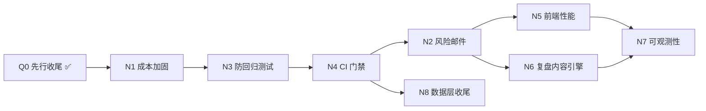

# 执行计划 · 2026-06-20

> 前置：`docs/CODE_REVIEW_2026-06-19.md`（T1–T9 已基本落地）、`docs/CODE_REVIEW_2026-06-20.md`（第二轮 N1–N8）。
> 本文档合并「本轮先行收尾任务」与「第二轮任务拆解」，供 Cursor / 执行工程师直接按卡推进。

---

## 0. 本轮先行任务（Q0，已完成）

| ID | 任务 | 状态 | 关键改动 | 验收 |
|---|---|---|---|---|
| Q0-1 | 文章标题模板按市场区分 | ✅ | `build_archive_title()` + 归档前 `enrich_article_record()` | ETF→`ETF行情走势异动分析`；LOF→`LOF行情走势异动分析`；A/HK/US 各自后缀 |
| Q0-2 | T8 剩余：`frontend/dist` 移出 git | ✅ | `git rm --cached frontend/dist`；`.gitignore` 明确 `frontend/dist/` | `git status` 不再漂移 `dist/index.html`；Dockerfile 多阶段构建产出 dist |
| Q0-3 | GEO：文章页 FAQ 块 | ✅ | `ArticleSeoService` 增加 FAQ HTML + `FAQPage` JSON-LD | `curl /analysis/{id}` 含「常见问题」与 `"@type": "FAQPage"` |
| Q0-4 | 风险股清单入口与导出 | ✅ | `NavBar` 增加「风险股清单」；契约测试覆盖 nav/footer/export | `/risk-stocks` 路由、API、Footer、NavBar、CSV/XLSX 导出均存在 |

**线上验收命令（部署后）**：

```bash
curl -s https://aguai.net/analysis/1607 | grep -E '常见问题|FAQPage|ETF行情走势'
curl -sI https://aguai.net/risk-stocks
curl -sI https://aguai.net/api/risk-stocks/export/csv
```

---

## 1. 第二轮任务总览（来自 CODE_REVIEW_2026-06-20）

| 优先级 | ID | 任务 | 类型 | 预估 | 依赖 |
|---|---|---|---|---|---|
| **P0** | N1 | `/api/analyze` 成本滥用加固 | 安全/成本 | 1 天 | — ✅ 已实现 |
| P1 | N2 | 风险提醒邮件/推送 | 增长/留存 | 1–2 天 | N1 ✅ 已实现 |
| P1 | N3 | ETF/LOF 防回归测试 | 质量 | 0.5 天 | Q0-1 已完成 ✅ |
| P1 | N4 | 测试套件 + CI 门禁 | 工程 | 1 天 | N1、N3 ✅ |
| P2 | N5 | 前端首屏性能（移动端） | 性能 | 1–2 天 | Q0-2 已完成 |
| P2 | N6 | 自动「诊断复盘」内容引擎 | SEO/GEO | 2–3 天 | T4/sitemap 已落地 |
| P3 | N7 | 可观测性补全 | 运维 | 1 天 | N1 |
| P3 | N8 | 数据层与配置一致性收尾 | 技术债 | 0.5–1 天 | Q0-2 部分完成 |

**明确不做（用户已确认）**：搜索引擎 sitemap ping cron。

---

## 2. 任务卡详情

### P0 — N1：`/api/analyze` 成本滥用加固

**为什么最优先**：匿名/批量可无额度、无限流地触发 N 次 LLM 调用，直接对应账单风险。

**文件**：
- `web_server.py` — `AnalyzeRequest`、`analyze()`（约 137、262–520 行）
- `services/quota_service.py` — 批量按只数扣减
- 新增 `tests/test_analyze_quota_and_limit.py`

**改动方案**：
1. `stock_codes` 限制 `conlist(str, min_length=1, max_length=20)`，超限 422
2. 移除「批量豁免额度」：`len(stock_codes)` 次校验与扣减
3. `/api/analyze` 增加 IP + user_id 窗口限流（`slowapi` 或复用 `_rate_limit_ok`）
4. 匿名额度显著低于绑定用户，强化绑定转化

**验收标准**：
- 21 个代码 → 422；20 个 → 扣 20 次额度
- 超阈值 → 429
- 测试覆盖：批量扣额、上限、限流

---

### P1 — N2：风险提醒邮件/推送（激活留存）

**文件**：
- `services/watchlist_risk_alert_service.py`
- `services/email_service.py` — 新增 `send_risk_alert_digest()`
- `services/risk_stock_scheduler.py`
- 用户通知偏好（新字段 `notify_pref`）

**改动方案**：
1. 自选股命中风险列表 → 生成 digest 邮件（已绑定邮箱）
2. `sync_alerts_for_trade_date` 后触发，同日同标的去重 + 频控
3. 邮件含免责声明 + 退订链接
4. 预留 Web Push / 公众号接口（不阻塞第一版）

**验收标准**：绑定用户收到摘要邮件；可退订；同日不重复轰炸。

---

### P1 — N3：ETF/LOF 防回归测试

**文件**：
- 新增 `tests/test_instrument_resolver.py`
- 复用 `services/instrument_name_resolver.py`

**覆盖用例**：
- 市场推断：`510300`/`159919`→ETF，`161725`→LOF，`688xxx`→A，`8xxxxx`→A
- 占位名（`stock_name == code`）二次解析
- tushare `fund_basic` 回退路径（mock）
- `/stock/{etf}` 与归档页显示真实基金名

**验收标准**：`pytest tests/test_instrument_resolver.py` 全绿；与 `test_etf_article_names.py` 不重复断言。

---

### P1 — N4：测试套件可运行性 + CI 门禁

**文件**：
- `.github/workflows/` — 新增 `test.yml` 或在现有 workflow 加 test job
- `requirements.txt`、`README.md` 运行说明

**改动方案**：
1. 干净环境：`pip install -r requirements.txt && pytest`
2. PR 门禁：analyze、quota、judgment verify、seo injection、instrument resolver
3. 不依赖本机 `.venv`

**验收标准**：GitHub Actions test job 全绿；PR 未过测试不可合并。

---

### P2 — N5：前端首屏性能（移动端优先）

**文件**：
- `frontend/vite.config.ts`
- 图表相关组件（echarts 懒加载）
- `frontend/build-metrics/` 体积预算

**证据**：`vendor-naive-ui` ~625K + `vendor-echarts` ~506K 未压缩。

**改动方案**：
1. echarts 动态 `import()`，移出初始 chunk
2. naive-ui 按需引入
3. SSR 落地页用户无需下载全量 JS 即可读结论（已部分满足）
4. 构建体积阈值告警

**验收标准**：首屏 JS gzip 明显下降；Lighthouse 移动端性能提升；echarts 不在 initial chunk。

---

### P2 — N6：自动「诊断复盘」内容引擎

**文件**：
- `services/judgment_verifier.py`
- `services/judgment_accuracy_service.py`
- `services/archive_service.py`
- 新增定时任务 + SSR 模板

**思路**：把 verifier 结构化结果聚合成周报/榜单页，例如：
- 「本周 AI 诊断复盘：命中率、典型命中案例」
- 「近 30 天结构偏强且验证为真的标的」

**改动方案**：
1. 每周 cron 生成 ≥1 篇复盘文章或独立 SSR 页
2. 纳入 `sitemap-core.xml`
3. 合规措辞：历史统计、仅供参考

**验收标准**：页面为真 SSR；数据来自 verifier；sitemap 可发现。

---

### P3 — N7：可观测性补全

**文件**：
- `services/analyze_slo_tracker.py`
- `web_server.py` — `/api/health`、`/api/ops/analyze-slo`
- 后台 scheduler 告警出口

**补强项**：
1. LLM 调用量/成本看板（按天、匿名 vs 绑定）
2. migrations / snapshot / risk / verification scheduler 失败外呼
3. health 暴露调度器与数据源状态

**验收标准**：可查 analyze 调用量与失败率；任务连续失败可告警。

---

### P3 — N8：数据层与配置一致性收尾

**文件**：
- `database/`、`tests/conftest.py`
- `docker-compose.prod.yml` 环境变量

**剩余项**（Q0-2 已处理 dist）：
1. 确认 `data/test_*.db*` 不再污染生产目录
2. sqlite WAL + `busy_timeout` 高并发写入验证
3. 根目录垃圾文件持续 gitignore（`CANCELED`、`ERROR` 等已加）

**验收标准**：跑全量测试后 `data/` 无新 test 库；高并发无 `database is locked`。

---

## 3. 推荐执行顺序



**严格顺序建议**：

1. ~~Q0 先行收尾~~（本文档 §0，已完成）
2. **N1** — 成本漏洞止血（半天–1 天）
3. **N3 + N4** — 测试与 CI 锁死核心路径（可并行，1–1.5 天）
4. **N2** — 风险邮件激活留存（1–2 天）
5. **N5 + N6** — 性能与内容复利（可并行，2–4 天）
6. **N7 + N8** — 运维与技术债收尾

---

## 4. 跨文档对照

| 文档 | 范围 | 关系 |
|---|---|---|
| `CODE_REVIEW_2026-06-19.md` | T1–T9 | 第一轮，已基本完成 |
| `CODE_REVIEW_2026-06-20.md` | N1–N8 | 第二轮诊断原文 |
| `2026-06-16-product-seo-trust-roadmap.md` | Task 1–11 | SEO/信任路线图；Task 10–11 与 N2/N6 重叠 |
| 本文档 | Q0 + N1–N8 可执行卡 | **当前执行入口** |

---

## 5. 部署提醒

生产部署流程不变：

```bash
git push origin main
# 服务器
git pull origin main
docker compose -f docker-compose.prod.yml up -d --build app
```

`frontend/dist` 由镜像内 `npm run build` 生成，服务器无需手动构建前端。
